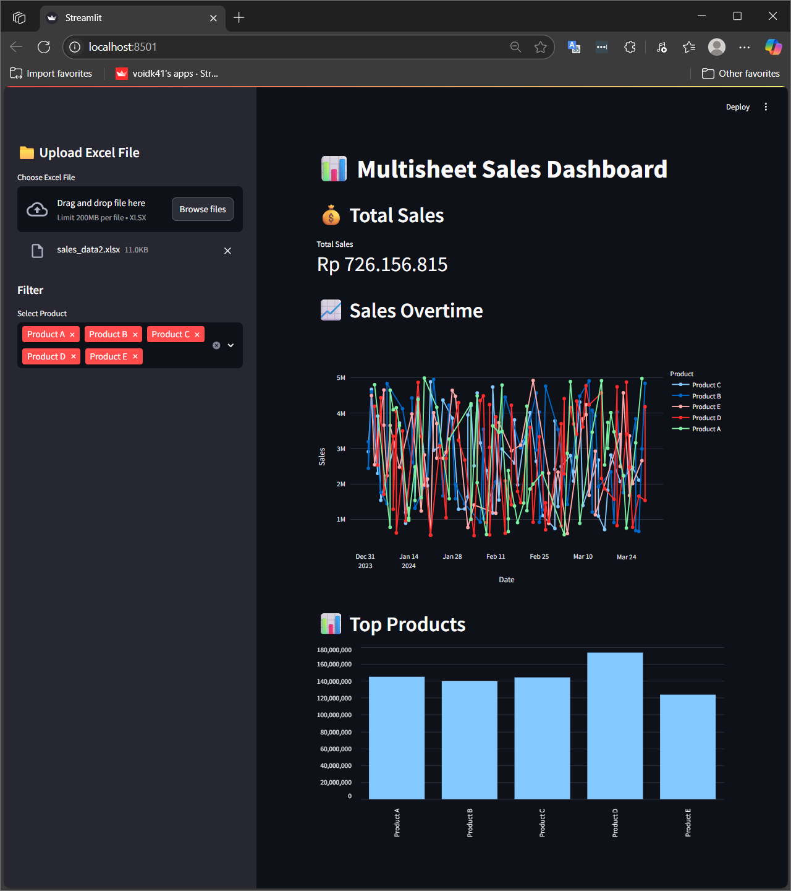

# 📊 Multisheet Sales Dashboard

A professional and modular Streamlit dashboard to extract, clean, and visualize sales data from multiple Excel sheets. Built for small businesses and analysts who need fast insights from scattered spreadsheet data.



---

## 🚀 Features

- ✅ Upload Excel files with **multiple sheets**
- ✅ Modular **ETL pipeline**: Extract → Transform → Load
- ✅ Automatically combine all sheets into one clean table
- ✅ Interactive Streamlit dashboard
- ✅ Visualizations:
  - Total Sales Summary
  - Sales Trend Over Time
  - Top-Selling Products
- ✅ Downloadable cleaned dataset

---

## 🛠️ Tech Stack

- Python 3.10+
- Pandas
- Streamlit
- Plotly
- SQLite (optional)
- Virtualenv

---

## 📁 Project Structure

```
dashboard-multisheet/
│
├── etl/               # Extract, transform, load modules
│   ├── extract.py
│   ├── transform.py
│   └── load.py
│
├── dashboard/         # Streamlit app layout
│   └── app.py
│
├── utils/             # Helper functions
│   └── helpers.py
│
├── assets/            # Screenshot & images
│   └── screenshot.png
│
├── data/              # (Optional) Sample Excel file
│
├── main.py            # Main run script
├── requirements.txt   # List of Python dependencies
├── .gitignore
└── README.md
```

---

## 🧪 How to Run

1. **Clone the repository**
```bash
git clone https://github.com/VoidK41/dashboard-multisheet
cd dashboard-multisheet
```

2. **Create virtual environment**
```bash
python -m venv venv
source venv/bin/activate     # On Windows: venv\Scripts\activate
```

3. **Install dependencies**
```bash
pip install -r requirements.txt
```

4. **Run the app**
```bash
streamlit run main.py
```

---

## 📸 Preview


---

## 👨‍💻 Author

**Khairu Ikramendra**  
Available for freelance dashboard & data analytics projects.  
Let’s connect on [Linkedin](https://www.linkedin.com/in/khairuikramendra/)(#) or explore more on [Upwork](https://www.upwork.com/freelancers/~017002e8546494c6e9?mp_source=share)(#)!

---

## 📄 License

MIT License — feel free to use and modify for your own projects.